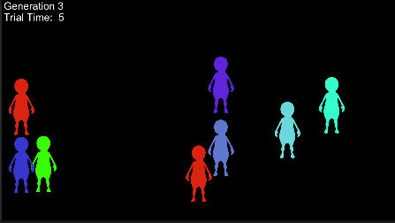

<h1> Camouflage system AI</h1>

     

 

<ul>
  <li><b>Description</b></li>
  
  
This project has as goal to simulate a camoufage system using Genetic Algorithms. In this the player maybe to click on most character numbers as possible and the system will analyze which character took the longest to be clicked. In consideration the ones that appear on the screen the longest as "genetically" best, he then produces characters in the next generation that blend the characteristics of the strongest ones.

  </ul>

<ul>
  <li><b>Descrição</b></li>
  
  Este projeto tem como objetivo de simular um sistema de camuflagem usando Algoritmos Genéticos. Nele o jogador tem que clicar no maior número de personagens possíveis e o sistema irá analisar qual personagem demorou mais para ser clicado. Considerando os que ficaram mais tempo na tela como melhores "geneticamente" ele então produz na próxima geração personagens que mesclam a características dos mais fortes anteriormente.
  </ul>

